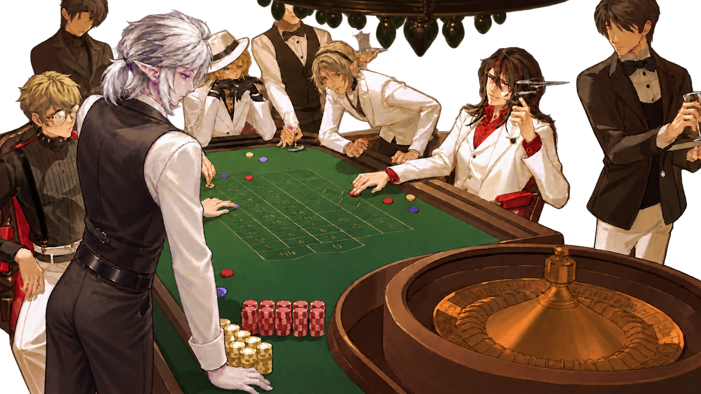
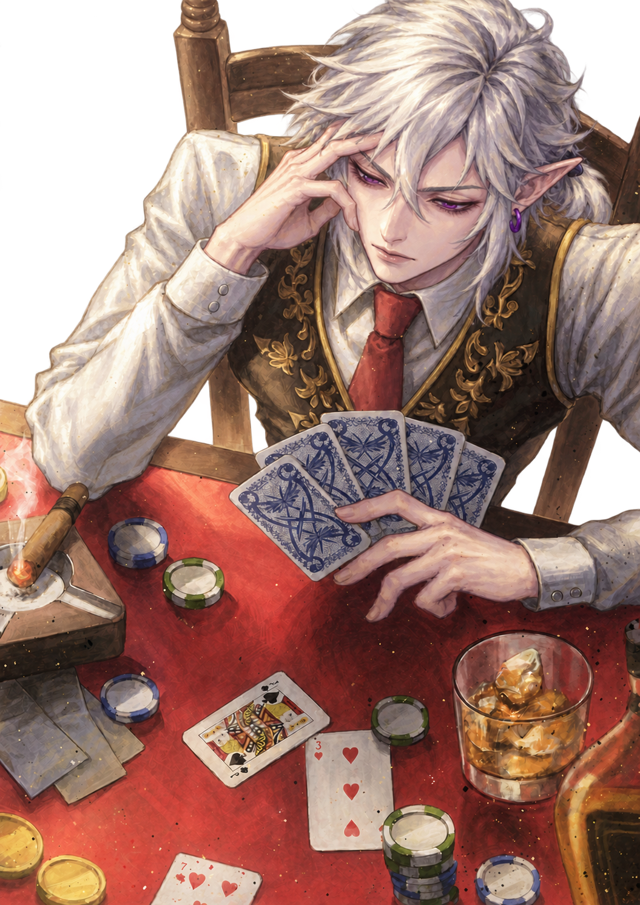
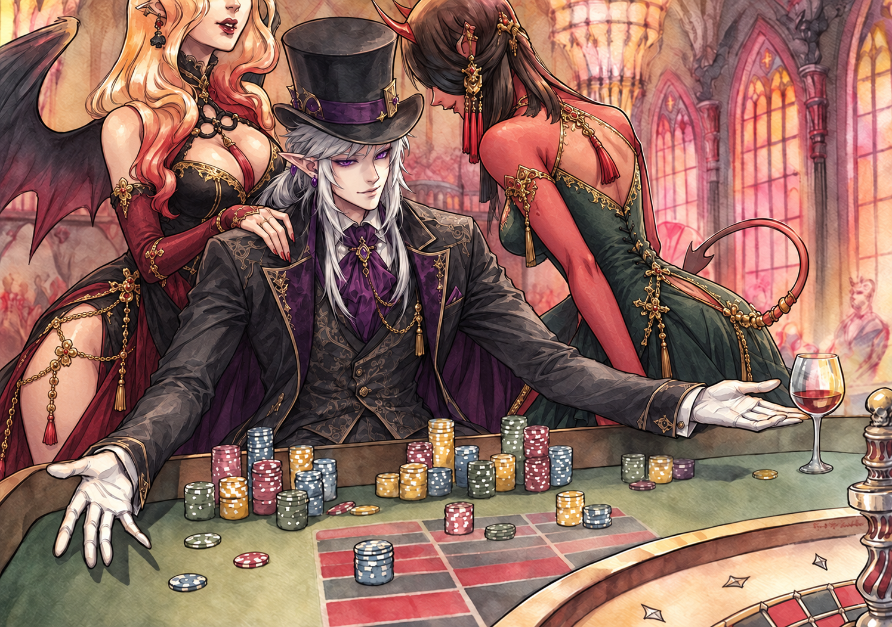
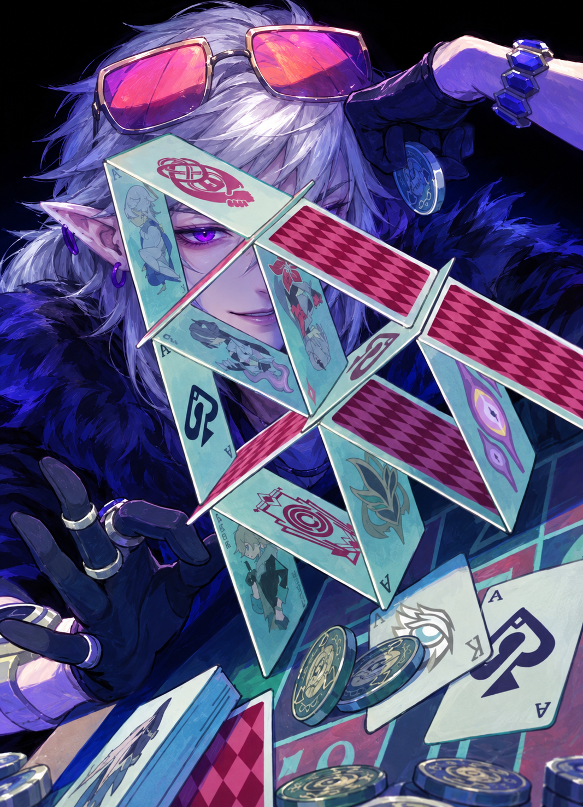
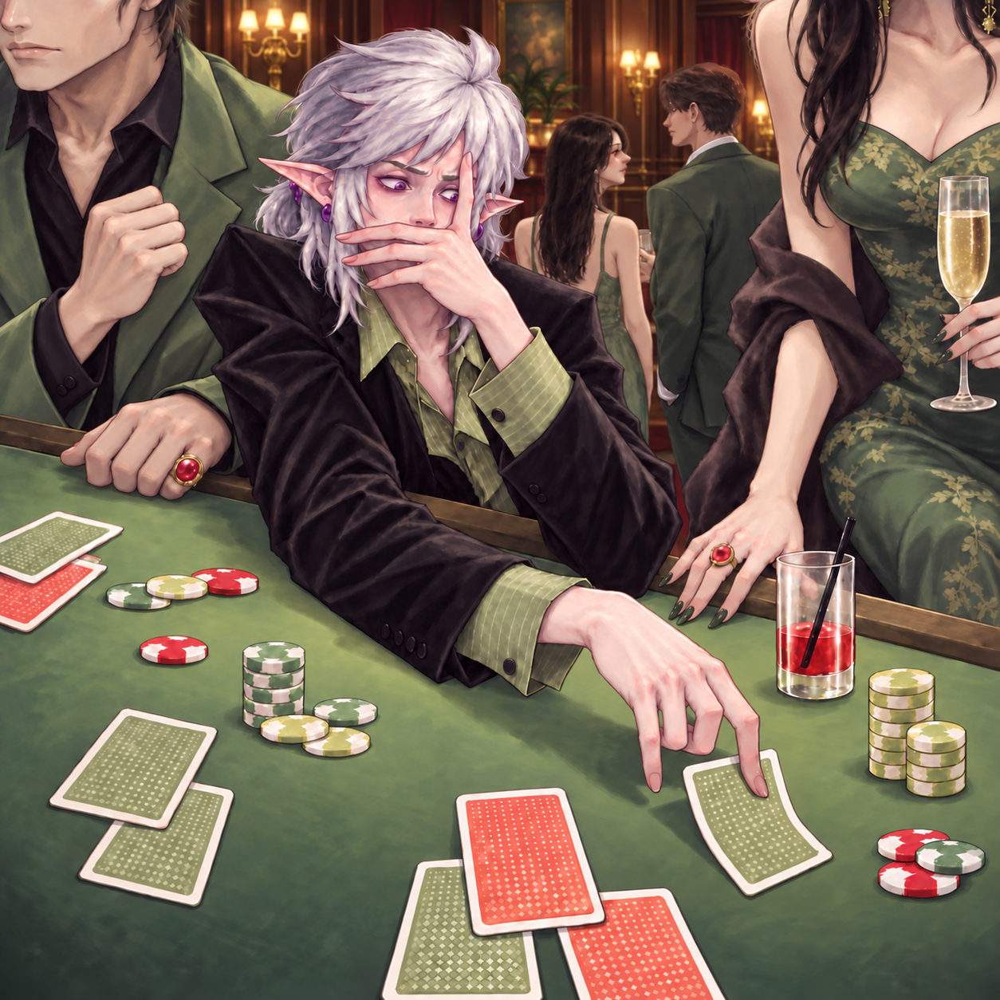

<div align="center">

# 🎲 Apolion Gacha

### Ваши вселенные. Ваши награды. Один бросок.

**Предметы · Способности · Существа · Особенности · Навыки**

**Версия 1.0.0** · Русский интерфейс · Работа без интернета · Собственные наборы


*Соберите награды из любимых миров — и доверьте выбор случаю.*

</div>

---

**Apolion Gacha** — локальное приложение для случайного выбора наград из вашей коллекции. Добавляйте предметы, способности, существ и другие записи из любых фэндомов, авторских миров или реальной жизни. Настраивайте источники, категории и редкость, выбирайте шаблон или делайте бросок без фильтров.

Это инструмент для настольных и текстовых ролевых игр, творческих экспериментов, генерации идей и собственных систем наград. Здесь нет покупки круток: содержимое коллекции и правила выбора задаёте вы.

> **Главная идея:** данные должны оставаться понятными и доступными. Награды и шаблоны хранятся в обычных текстовых файлах, которые можно открыть и изменить без специальных редакторов и серверов.

<a id="contents"></a>
## 🧭 Навигация

- [Возможности](#features)
- [Быстрый старт](#start)
- [Фильтры: галочка, крестик и пустой квадрат](#filters)
- [Примеры выбора](#examples)
- [Редкость и вероятность](#rarity)
- [Результат и копирование](#result)
- [Файлы и добавление наград](#data)
- [Шаблоны](#templates)
- [Темы, иконки и управление](#interface)
- [Перенос и резервные копии](#backup)
- [Исходники, происхождение и условия использования](#about)
- [Частые ошибки](#mistakes)

---

<a id="features"></a>
## ✨ Возможности

<p align="center">
  
</p>

- **Собственная коллекция.** Наполняйте приложение тем, что интересно именно вам.
- **Любые категории.** Используйте стандартные или добавляйте свои через новые файлы.
- **Источники и фэндомы.** Отделяйте аниме от игр, авторские миры от реальности и выбирайте нужные вселенные.
- **Включение и исключение.** Галочкой ограничивайте выбор, крестиком убирайте нежелательное.
- **Два режима броска.** Крутка с фильтрами и полный рандом без изменения ваших отметок.
- **Настраиваемая редкость.** Строгие границы и предпочтение вокруг выбранного центра.
- **Шаблоны параметров.** Быстро переключайтесь между готовыми диапазонами или создавайте собственные.
- **Поиск и прокрутка.** Все четыре панели рассчитаны на длинные списки.
- **Копирование результата.** Переносите выпавшую награду в заметки, чат или карточку персонажа.
- **Светлая и тёмная темы.** Единый фиолетовый стиль и выбор иконки приложения.
- **Локальные файлы.** Без аккаунта, онлайн-переводчика и отдельной системы баз данных.

**Начальные записи — примеры заполнения**, а не полноценная энциклопедия наград. Их можно заменить своей коллекцией.

---

<a id="start"></a>
## 🚀 Быстрый старт

<p align="center">
  
</p>

### Запуск

1. Скачайте архив приложения.
2. **Полностью распакуйте** его в обычную папку с доступом на запись.
3. Запустите `ApolionGacha.exe`.
4. Выберите шаблон или задайте `Мин.`, `Сред.` и `Макс.` вручную.
5. При необходимости отметьте источники, фэндомы и категории.
6. Нажмите кнопку **игральных костей** для крутки по фильтрам.

Приложение предназначено для **Windows 10/11, x64**. Устанавливать Python или другие среды выполнения для запуска готового `.exe` не нужно. Интернет для работы приложения не используется.

> **Не запускайте `.exe` прямо из ZIP и не переносите его отдельно.** Рядом должны оставаться папки `data`, `img` и `source`.

### Основные кнопки

| Значок | Действие |
| :--- | :--- |
| Карандаш | Открыть папку `data` для редактирования наград и шаблонов |
| Двадцатигранник | Выбрать награду без фильтров источников, фэндомов и категорий |
| Игральные кости | Выбрать награду с текущими фильтрами |
| Дискета | Скопировать показанный результат в буфер обмена |
| Шестерёнка | Открыть настройки и справку |
| Круговые стрелки в панели | Снять отметки и очистить поиск **только в этой панели** |
| Стрелка назад | Вернуться из настроек |

**Важно:** у полного рандома продолжают действовать `Мин.`, `Сред.`, `Макс.` и поле `Включено`. Он не включает отключённые записи и не сбрасывает настройки.

---

<a id="filters"></a>
## ✅ Фильтры: галочка, крестик и пустой квадрат

<p align="center">
  
</p>

На главном экране находятся четыре постоянные панели: **Источники**, **Фэндом**, **Категории** и **Шаблон**. Это списки внутри панелей, а не выпадающие меню.

### Три состояния

В первых трёх панелях каждый пункт переключается последовательно:

**Пустой квадрат → фиолетовая галочка → фиолетовый крестик → пустой квадрат.**

| Состояние | Что означает |
| :--- | :--- |
| Галочка | Разрешить этот вариант; если в панели есть хотя бы одна галочка, остальные неотмеченные варианты не участвуют |
| Крестик | Исключить этот вариант |
| Пусто | Разрешить, если в этой панели нет галочек; иначе не включать в выбор |

> **Нет галочек — разрешено всё, кроме крестиков. Есть галочки — разрешены только варианты с галочками.** Это правило применяется отдельно к каждой из трёх панелей.

Несколько галочек **в одной панели** означают «любой из отмеченных». Условия **разных панелей** выполняются одновременно: запись должна подходить по источнику, фэндому и категории.

У каждой награды **один источник, один фэндом и одна категория**. Если один и тот же объект представлен в разных источниках или вселенных, создавайте отдельные записи.

### Фэндомы зависят от источников

Список фэндомов строится по включённым записям с разрешёнными источниками. При выборе `Сериалы` остаются фэндомы, для которых в вашей коллекции есть включённые записи с этим источником.

Это не встроенный справочник экранизаций: фэндом появляется в списке благодаря вашим данным.

**Скрытые отметки сохраняются.** Если фэндом исчез из списка после смены источников, его прежняя галочка или крестик не удаляется. Сброс панели снимает и видимые, и скрытые отметки.

### Поиск и прокрутка

- Поиск скрывает неподходящие названия **в списке**, но не меняет фильтры крутки.
- В панелях источников и фэндомов поиск расположен внизу, над сбросом.
- В панелях категорий и шаблонов поиск расположен вверху, под сбросом.
- Длинные списки прокручиваются колёсиком при наведении на панель.
- При необходимости появляется фиолетовая полоса прокрутки; её можно перетаскивать.

### Особое правило шаблонов

В панели **«Шаблон»** нет крестиков и множественного выбора. Выбрать можно **один** шаблон: другая галочка снимает предыдущую. Подробности — в [разделе о шаблонах](#templates).

---

<a id="examples"></a>
## 🧩 Примеры выбора

<p align="center">
  
</p>

Примеры предполагают, что соответствующие записи уже добавлены в вашу коллекцию и попадают в заданный диапазон редкости.

| Источники | Фэндом | Категории | Что участвует в крутке |
| :--- | :--- | :--- | :--- |
| ✓ Аниме | Пусто | Пусто | Любые категории из любых аниме в коллекции |
| ✓ Аниме | ✓ Ван Пис, ✓ Наруто, ✓ Блич | Пусто | Любые категории из этих фэндомов с источником «Аниме» |
| ✓ Аниме | ✓ Ван Пис, ✓ Наруто, ✓ Блич | ✓ Предметы | Только предметы из указанных аниме |
| Пусто | ✓ Ван Пис | Пусто | Записи фэндома «Ван Пис» из любых разрешённых источников |
| Пусто | Пусто | ✓ Предметы | Только предметы независимо от источника и фэндома |
| ✕ Аниме | Пусто | Пусто | Всё, кроме записей с источником «Аниме» |
| Пусто | ✓ Наруто, ✕ Ван Пис | Пусто | Только Наруто: галочка ограничивает панель этим фэндомом |
| Пусто | Пусто | Пусто | Все включённые записи в пределах редкости |

**Пример с адаптацией:** запись `Источник: Аниме` не участвует при выборе только `Сериалы`. Чтобы предмет из сериальной адаптации тоже участвовал, добавьте отдельную запись с источником `Сериалы` и нужным фэндомом.

Если хочется на один бросок проигнорировать эти три панели, используйте **двадцатигранник**. После броска отметки останутся на месте.

---

<a id="rarity"></a>
## 💎 Редкость и вероятность

<p align="center">
  
</p>

### Мин., Сред. и Макс.

| Параметр | Значение |
| :--- | :--- |
| **Мин.** | Нижняя включительная граница редкости |
| **Сред.** | Центр предпочтения: чем ближе редкость к нему, тем больше вес записи |
| **Макс.** | Верхняя включительная граница редкости |

Допустимые значения:

```text
0 ≤ Мин. ≤ Сред. ≤ Макс. ≤ 10
```

Дробная часть записывается **через точку**: `6.5`, не `6,5`.

**Сред. — не обещание точного среднего результата.** Реальные шансы зависят от того, какие записи есть в коллекции и проходят фильтры. Если все три значения равны `2.5`, участвуют только записи с редкостью ровно `2.5`.

### Как рассчитывается шанс

Сначала приложение отбирает включённые записи в пределах редкости и, для обычной крутки, применяет фильтры. Затем вычисляет вес каждой подходящей записи:

```text
Вес записи = 4 ^ (−|редкость записи − Сред.|)
Шанс записи = её вес / сумма весов всех подходящих записей
```

При расстоянии от центра `0` вес равен `1`; при расстоянии `1` — `0.25`; при расстоянии `2` — `0.0625`. Это относительные веса, не готовые проценты.

> **Выбирается сразу запись из общего подходящего списка.** Категория, источник и фэндом не разыгрываются отдельным предварительным броском.

Поэтому:

- У отдельных записей с одинаковой редкостью одинаковые шансы.
- Фэндом с большим числом подходящих записей обычно получает больший суммарный шанс.
- Сотня записей одного фэндома подряд в файле не даёт преимущества из-за расположения.
- **Повторы разрешены:** одна награда или один фэндом могут выпадать несколько раз подряд.
- Гаранта, защиты от повторов и обязательного чередования нет.

Например, если подходят 100 предметов Наруто и 10 предметов Блич с одинаковой редкостью, шансы отдельных предметов равны, но суммарный шанс Наруто выше. Если редкости различаются, нужно учитывать и веса.

### Ранги

Ранг и цвет определяются **автоматически по числовой редкости**. Отдельного поля ранга в файлах нет.

| Редкость | Ранг |
| :--- | :--- |
| От 0.0 до 1.0, не включая 1.0 | Мусорный |
| От 1.0 до 2.0, не включая 2.0 | Обычный |
| От 2.0 до 3.0, не включая 3.0 | Необычный |
| От 3.0 до 4.0, не включая 4.0 | Редкий |
| От 4.0 до 5.0, не включая 5.0 | Элитный |
| От 5.0 до 6.0, не включая 6.0 | Эпический |
| От 6.0 до 7.0, не включая 7.0 | Легендарный |
| От 7.0 до 8.0, не включая 8.0 | Мифический |
| От 8.0 до 9.0, не включая 9.0 | Божественный |
| От 9.0 до 10.0 включительно | Трансцендентный |

Название шаблона и ранг награды — **не одно и то же**. Божественный шаблон может выдать трансцендентную награду, если она проходит его диапазон.

---

<a id="result"></a>
## 🃏 Результат и копирование

<p align="center">
  
</p>

В центральной области показываются:

- название награды;
- категория;
- числовая редкость и ранг;
- шанс выпадения;
- источник;
- фэндом;
- описание.

Длинный результат можно прокручивать колёсиком или полосой прокрутки.

### Что делает дискета

Кнопка **дискеты** копирует результат **как текст** в буфер обмена. После этого нажмите `Ctrl+V` в заметках, текстовом редакторе, чате или другом приложении.

Она **не создаёт файл**, не сохраняет изображение окна и не ведёт отдельный журнал наград. Для постоянного хранения вставьте текст в нужное место самостоятельно.

> Процент относится к условиям **совершённой крутки**. Изменение фильтров или редкости не пересчитывает шанс уже показанной награды. Новый шанс появится при следующем броске.

---

<a id="data"></a>
## 📁 Файлы и добавление наград

<p align="center">
  
</p>

### Где что хранится

| Путь относительно папки приложения | Назначение |
| :--- | :--- |
| `ApolionGacha.exe` | Запуск приложения |
| `data/Предметы.txt` | Записи категории «Предметы» |
| `data/Способности.txt` | Записи категории «Способности» |
| `data/Существа.txt` | Записи категории «Существа» |
| `data/Особенности.txt` | Записи категории «Особенности» |
| `data/Навыки.txt` | Записи категории «Навыки» |
| `data/Шаблоны.txt` | Наборы параметров редкости |
| `data/Название категории.txt` | Ваша дополнительная категория |
| `img/` | Графика интерфейса |
| `img/icon/` | Значки `.ico` |
| `source/interface.txt` | Сохранённые настройки интерфейса и связь с ярлыком |
| `source/` | Исходный код, ресурсы и файлы сборки |
| `Инструкция.txt` | Инструкция, доступная без открытия репозитория |

Файлы категорий находятся **непосредственно в `data`**, без дополнительной папки `category`. Файл `Шаблоны.txt` — служебный: он не считается категорией наград.

### Добавить запись

1. Нажмите карандаш или откройте `data` вручную.
2. Откройте нужный файл категории в Блокноте или другом текстовом редакторе.
3. Добавьте блок по образцу ниже.
4. Заполните поля. Для новой записи оставьте `Код:` пустым.
5. Сохраните файл в **UTF-8**, с BOM или без него.
6. Вернитесь в приложение; при необходимости нажмите `F5`.

```text
=== ЗАПИСЬ ===
Код:
Название: Компас путешественника
Редкость: 2.5
Источник: Авторское
Фэндом: Мир странников
Включено: Да
Описание:
Небольшой компас, который указывает на ближайшее безопасное убежище.

Стрелка начинает дрожать, если на пути находится опасность.
=== КОНЕЦ ===
```

### Значение полей

| Поле | Что писать |
| :--- | :--- |
| `Код:` | У новой записи — пустое значение; существующий код сохраняйте |
| `Название:` | Название награды |
| `Редкость:` | Число от 0.0 до 10.0, дробная часть через точку |
| `Источник:` | Одно название: например, Аниме, Игра, Книга, Реальный мир |
| `Фэндом:` | Одно название вселенной или авторского мира |
| `Включено:` | Только `Да` или `Нет` |
| `Описание:` | Непустой текст, который может занимать несколько абзацев |

**Категория определяется именем файла.** Поле `Категория:` внутри записи добавлять не нужно.

Источники и фэндомы появляются из ваших записей: отдельный файл со справочником тегов не нужен. Пишите одинаковые названия одинаково: `Ван Пис` и `One Piece` — разные варианты для приложения.

### Несколько записей подряд

В одном файле можно хранить много записей. Каждая имеет собственное начало и конец. Между блоками удобно оставлять пустую строку:

```text
=== ЗАПИСЬ ===
Код:
Название: Дорожный фонарь
Редкость: 1.0
Источник: Реальный мир
Фэндом: Реальный мир
Включено: Да
Описание:
Фонарь для освещения дороги.
=== КОНЕЦ ===

=== ЗАПИСЬ ===
Код:
Название: Карта старой крепости
Редкость: 2.5
Источник: Авторское
Фэндом: Мир странников
Включено: Да
Описание:
На карте отмечен забытый подземный вход.
=== КОНЕЦ ===
```

**Каждый разделитель пишется на отдельной строке.** Не склеивайте конец и начало в `=== КОНЕЦ ====== ЗАПИСЬ ===`. Не используйте строки-разделители внутри описания.

### Как обращаться с кодом

При загрузке корректной новой записи приложение присваивает уникальный код и записывает его в файл. Перед этим сохраняется прежняя версия файла с расширением `.txt.bak`.

- **Новая награда или отдельная версия существующей:** оставьте значение `Код:` пустым, но не удаляйте саму строку.
- **Редактирование существующей награды:** сохраняйте её код.
- **Перенос между категориями:** перенесите блок и сохраните код; не оставляйте копию со старым кодом в исходном файле.

Не используйте один код для двух записей. Автоматический `.bak` может перезаписываться при следующем назначении кодов — это не полноценная история всех изменений.

### Создать категорию, отключить или удалить награду

- Для своей категории создайте в `data` файл `Название категории.txt` и добавьте корректную запись.
- **Пустая новая категория не появляется в списке**, пока в ней нет загруженной записи. Стандартные категории отображаются и без записей.
- `Включено: Нет` отключает запись, в том числе для полного рандома.
- Для удаления награды удалите весь её блок, включая начало и конец.
- Если очищаете стандартную категорию, оставьте сам файл на месте: отсутствие стандартного файла вызывает ошибку загрузки.

### Обновление и большие коллекции

Сохранённые изменения обнаруживаются примерно за две секунды либо при возвращении в приложение. `F5` принудительно перечитывает данные.

Данные загружаются в память, а подходящий набор и веса повторно используются, пока параметры не изменились. Одинаковые условия не требуют полного чтения текстовых файлов перед каждым броском. Однако загрузка очень крупных коллекций и длинных описаний зависит от компьютера; обещания мгновенной работы на любой машине нет.

Можно заполнять файлы последовательно по фэндомам. **Порядок записей не влияет на их вероятность.**

---

<a id="templates"></a>
## 📜 Шаблоны

<p align="center">
  
</p>

Шаблон — сохранённый набор значений **Мин. / Сред. / Макс.** Он не является наградой и не выбирает источник или фэндом.

### Использование

- Нажмите шаблон, чтобы применить его значения.
- Одновременно выбран только **один** шаблон.
- Нажатие другого шаблона заменяет выбор.
- Повторное нажатие выбранного шаблона снимает галочку.
- Сброс панели снимает галочку и очищает поиск, **но оставляет текущие числа**.
- Ручное изменение чисел снимает выбор шаблона, не изменяя его файл.

### Стандартные параметры

| Шаблон | Мин. | Сред. | Макс. |
| :--- | ---: | ---: | ---: |
| Бронзовый | 0.1 | 1.3 | 3.3 |
| Серебряный | 0.5 | 2.3 | 4.3 |
| Золотой | 1.5 | 3.3 | 5.3 |
| Платиновый | 2.5 | 4.3 | 6.3 |
| Алмазный | 3.5 | 5.3 | 7.3 |
| Легендарный | 4.5 | 6.3 | 8.3 |
| Мифический | 5.5 | 7.3 | 9.3 |
| Божественный | 6.5 | 8.3 | 10.0 |

### Создание и редактирование

Шаблоны редактируются **только через `data/Шаблоны.txt`**. Отдельных окон создания и редактирования в текущем приложении нет.

```text
=== ШАБЛОН ===
Название: Мой шаблон
Мин: 1.0
Сред: 2.0
Макс: 4.0
=== КОНЕЦ ===
```

Для нового шаблона добавьте блок с уникальным названием. Для изменения исправьте его поля. Для удаления уберите блок полностью. Пустой файл шаблонов допустим; сам файл оставьте на месте.

**В файле подписи пишутся без точки:** `Мин:`, `Сред:`, `Макс:`. Значения должны удовлетворять тому же правилу `0 ≤ Мин ≤ Сред ≤ Макс ≤ 10`.

---

<a id="interface"></a>
## 🎨 Темы, иконки и управление

<p align="center">
  
</p>

### Оформление

По умолчанию используются **тёмная тема и иконка № 1**.

- В тёмной теме основной текст белый.
- В светлой теме основной текст чёрный.
- Отметки, элементы управления и полосы прокрутки выдержаны в фиолетовом стиле.
- В настройках активная тема и выбранная иконка показываются вариантом `on`, остальные — `off`.
- Интерфейс и данные рассчитаны на русский язык; встроенного перевода результата нет.

Настройки сохраняются в `source/interface.txt`. Это не файл наград и не файл шаблонов. Обычно его не нужно редактировать вручную.

### Смена иконки

В настройках можно выбрать один из доступных вариантов. Картинки `icon1-on.png` / `icon1-off.png` и аналогичные отображают выбор внутри интерфейса; соответствующие `.ico` лежат в `img/icon/`.

Иконка окна приложения меняется, но **встроенный значок самого `.exe` остаётся № 1**. Выбор в настройках не пересобирает исполняемый файл.

### Ярлык Windows

Приложение **не создаёт и не удаляет ярлыки автоматически**.

1. Создайте ярлык на `ApolionGacha.exe` вручную средствами Windows.
2. Откройте настройки приложения.
3. Нажмите **«Указать ярлык»** и выберите созданный `.lnk`.
4. При смене иконки приложение будет обновлять этот выбранный ярлык.

Ярлык должен указывать на `.exe` именно из текущей папки приложения. После перемещения ярлыка выберите его заново. **«Отвязать ярлык»** удаляет связь из настроек, но не сам ярлык.

Закреплённые значки на панели задач могут потребовать открепления и повторного закрепления из-за поведения Windows.

### Клавиатура и мышь

| Действие | Управление |
| :--- | :--- |
| Перечитать данные | `F5` |
| Крутка по фильтрам | `Пробел`, если фокус не в поле ввода |
| Копировать результат | `Ctrl+C`, когда фокус на основном окне |
| Вставить скопированный результат в другое приложение | `Ctrl+V` |
| Вернуться из настроек | `Esc` |
| Прокрутить справку | `Page Up` / `Page Down` |
| Прокрутить список или результат | Колёсико над нужной областью |
| Переместить ползунок | Перетаскивание фиолетовой полосы прокрутки |

Внутри текстовых полей сочетания работают как команды редактора. Например, `Ctrl+C` в поле поиска копирует выделенный текст поля, а не карточку награды.

---

<a id="backup"></a>
## 🧳 Перенос и резервные копии

<p align="center">
  
</p>

Приложение переносится **всей папкой целиком**. Копируйте вместе `.exe`, `data`, `img`, `source` и инструкцию.

### Перед редактированием коллекции

- Сделайте отдельную копию `data` вне рабочей папки данных.
- Сохраните `source/interface.txt`, если хотите перенести настройки.
- Не рассчитывайте только на автоматические `.bak`: они создаются при записи автокодов, а не при каждой вашей правке.
- При больших изменениях удобно делать датированные архивы коллекции.

### Где нельзя хранить запасные копии

Не кладите в `data` инструкции и запасные файлы с расширением `.txt`. Приложение рассматривает такие файлы как дополнительные категории и пытается читать записи из них.

Используйте отдельную папку резервных копий или расширение `.bak`. Например, `Предметы.txt.bak` не считается категорией, а `Предметы — копия.txt` считается.

### После переноса

Проверьте путь в ярлыке, при необходимости создайте его заново и выберите в настройках. Папка приложения должна быть доступна для записи: это нужно для настроек и автоматических кодов. Обычно запуск от администратора не требуется.

---

<a id="about"></a>
## 🛠️ Исходники, происхождение и условия использования

<p align="center">
  
</p>

### Для разработчиков

Исходный код находится в `source`. Приложение написано на **C++17**, использует интерфейс Windows и GDI+. Для использования готового приложения собирать его самостоятельно не нужно.

| Файл | Назначение |
| :--- | :--- |
| `main.cpp` | Окно, интерфейс, загрузка данных и взаимодействие с Windows |
| `core.hpp` | Формат записей, фильтры и алгоритмы выбора |
| `test_core.cpp` | Проверки ядра |
| `resources.rc`, `app.manifest` | Ресурсы исполняемого файла и манифест |
| `build-windows.cmd` | Сборка через инструменты Visual Studio для x64 |
| `build-mingw.sh` | Сборка MinGW-w64 из Linux |

Сборочный скрипт Windows запускается в **x64 Native Tools Command Prompt** Visual Studio. Скрипт MinGW запускается из папки `source` при установленном соответствующем наборе инструментов.

### Происхождение идеи

Идея проекта вдохновлена **Chaos Gacha** автора **Bronz / BronzDeck**. В Apolion Gacha заново написан код и переработаны интерфейс, организация данных и управление выбором. Названия рангов, палитра редкости и начальные параметры шаблонов опираются на исходный проект. Полная коллекция наград оригинала не включена.

### Условия автора

**Автор проекта — Apolion.** Использование, изменение и бесплатное распространение разрешаются в соответствии с отдельным файлом `LICENSE.txt`. Продажа приложения и его изменённых версий не разрешается без отдельного согласия правообладателя. Упоминание автора приветствуется, но не является обязательной публичной благодарностью.

> Этот раздел — краткое описание намерений автора, а не замена лицензии. Перед публикацией добавьте выбранный и проверенный `LICENSE.txt` в репозиторий. Условия сторонних материалов действуют отдельно.

Описания предметов, персонажи и изображения из чужих вселенных могут иметь собственных правообладателей. Наличие записи в коллекции само по себе не даёт прав на сторонний контент.

---

<a id="mistakes"></a>
## ⚠️ Частые ошибки

<p align="center">
  
</p>

**Если в данных обнаружена ошибка, приложение показывает файл, строку и причину и приостанавливает крутки до исправления.** Это защита от случайного выбора из неполностью загруженной коллекции.

### 1. Новая категория не появилась

**Причина:** создан пустой `.txt` без записей. Это допустимый файл, но название новой категории берётся из загруженных записей.

**Исправление:** добавьте хотя бы один корректный блок, сохраните файл в `data` и нажмите `F5`. Если категория всё ещё не видна, очистите поиск в панели категорий.

### 2. После копирования блока возникла ошибка кода

**Причина:** вместе с записью скопирован существующий уникальный код. Названия наград могут совпадать, коды — нет.

**Исправление:** у новой записи оставьте строку `Код:`, но удалите её значение. Для переноса существующей записи сохраните код и удалите исходный блок из прежнего файла.

### 3. Приложение не понимает `6,5`

**Причина:** использована десятичная запятая.

**Исправление:** пишите `6.5`. Это касается редкости наград, полей Мин./Сред./Макс. и файлов шаблонов. Допустимы только числа от 0 до 10.

### 4. Несколько записей превратились в одну или не читаются

**Причина:** склеены разделители, пропущен `=== КОНЕЦ ===` или служебная строка оказалась внутри описания.

**Исправление:** каждое начало и конец должны стоять на отдельной строке. Проверьте, что каждому началу соответствует конец. Между блоками оставляйте перенос строки, лучше — пустую строку.

### 5. Появилась ошибка неизвестного или незаполненного поля

**Причина:** изменена русская подпись, добавлено неподдерживаемое поле, пропущено двоеточие или оставлено пустым обязательное значение.

**Исправление:** сверяйтесь с образцом. Не добавляйте поля `Категория:` и `Ранг:` — они вычисляются. `Описание:` должно быть последним полем перед текстом описания. Пустым у новой записи оставляют только значение `Код:`.

### 6. В источнике или фэндоме указано несколько значений

**Причина:** попытка перечислить несколько источников или вселенных в одной записи, например через `;`.

**Исправление:** используйте один источник и один фэндом. Другую версию объекта оформите отдельной записью с новым кодом. Запятая не служит разделителем тегов: текст с запятой не создаёт несколько тегов.

### 7. Дублируются названия фэндомов или источников

**Причина:** разные написания одного названия, язык или опечатка: например, `Ван Пис` и `One Piece`.

**Исправление:** выберите единое написание и приведите записи к нему. Приложение не сопоставляет альтернативные названия автоматически.

### 8. После правки ничего не изменилось

**Причина:** файл не сохранён, редактируется другая копия приложения, файл имеет неверное расширение либо кодировку.

**Исправление:** сохраните именно рабочий файл в `data`, выберите UTF-8 и нажмите `F5`. Проверьте полное имя: `Оружие.txt.txt` создаст категорию с неожиданным названием, а файл другой формы может вообще не попасть в загрузку.

### 9. Нет подходящих записей

**Причина:** сочетание фильтров и редкости исключило все включённые записи; осталась скрытая галочка; выбранная категория пуста.

**Исправление:** проверьте диапазон, поле `Включено` и сбросьте нужные панели. Поиск сам по себе не снимает старые отметки. Для проверки всех включённых записей без трёх фильтров нажмите двадцатигранник, помня, что диапазон редкости остаётся в силе.

### 10. Значения Мин./Сред./Макс. отклоняются

**Причина:** нарушено правило `0 ≤ Мин. ≤ Сред. ≤ Макс. ≤ 10`.

**Исправление:** расположите значения в правильном порядке. При равных границах нужна запись с ровно такой редкостью; само равенство ошибкой не является.

### 11. Шаблон пропал или не загружается

**Причина:** пустой файл, повторяющееся название, неверные подписи или границы.

**Исправление:** проверьте блок `=== ШАБЛОН ===`, уникальность названия и поля `Мин:`, `Сред:`, `Макс:`. Название шаблона не должно повторяться. Для файла шаблонов и наград используются разные начальные разделители.

### 12. Сбросил шаблон, а числа остались

**Причина:** это предусмотренное поведение, не ошибка.

**Что делать:** если нужны другие числа, измените их вручную или выберите другой шаблон. Сброс выбора не означает сброс диапазона.

### 13. Выпадает один фэндом или повторяется награда

**Причина:** независимые броски допускают серии; у фэндома может быть больше подходящих записей или более высокие веса.

**Что делать:** проверьте реальные данные и фильтры. Перестановка строк не исправит распределение — их порядок не влияет на вероятность. Повтор не означает неисправность генератора случайных чисел.

### 14. Полный рандом не выдаёт отключённую или слишком редкую запись

**Причина:** он игнорирует только источники, фэндомы и категории, но не `Включено: Нет` и не Мин./Сред./Макс.

**Исправление:** включите запись и задайте подходящий диапазон, если хотите, чтобы она участвовала.

### 15. Ошибка после добавления инструкции или резервной копии в `data`

**Причина:** дополнительный `.txt` прочитан как категория; обычный текст не соответствует формату, а копия наград может повторять коды.

**Исправление:** перенесите инструкции и запасные копии в другую папку либо используйте `.bak`. Не удаляйте стандартные файлы категорий и `Шаблоны.txt`: при необходимости очистите их содержимое.

### 16. Не сохраняются настройки или автоматические коды

**Причина:** нет доступа на запись или файл недоступен для изменения.

**Исправление:** перенесите приложение в обычную доступную папку, проверьте атрибут «Только чтение» и сохраните изменения редактора. Не используйте запуск от администратора как обязательное решение.

### 17. После переноса приложение не запускается или пропала графика

**Причина:** перенесён только `.exe`, запуск идёт внутри архива, удалены или переименованы ресурсы.

**Исправление:** полностью распакуйте архив и сохраняйте структуру папок. Иллюстрации README из `images` не заменяют ресурсы интерфейса из `img`.

### 18. Значок ярлыка не меняется

**Причина:** ярлык не выбран в настройках, перемещён, указывает на другую копию приложения или Windows показывает закреплённый старый значок.

**Исправление:** выберите нужный `.lnk` через «Указать ярлык», проверьте его цель и при необходимости повторно закрепите приложение. Потерянный ярлык программа не создаёт заново. Значок `.exe` остаётся встроенным независимо от выбора.

### 19. Дискета ничего не сохранила в папку

**Причина:** кнопка копирует текст в буфер обмена, а не записывает файл.

**Исправление:** сначала выполните крутку, затем скопируйте результат и вставьте через `Ctrl+V`. Если буфер обмена занят другим приложением, повторите копирование.

### 20. В README не показываются изображения

**Причина:** загружен только `README.md`, папка `images` переименована, изменён регистр или расширение файла.

**Исправление:** разместите `README.md` и папку `images` рядом в корне репозитория. В этом комплекте имена имеют одно расширение: `apolion-gacha1.png`, а не `apolion-gacha1.png.png`. Сохраняйте названия и относительные пути.

---

<div align="center">

**Apolion Gacha · 1.0.0**

*Наполняйте коллекцию. Выбирайте миры. Бросайте кости.*

[Вернуться к навигации](#contents)

</div>
